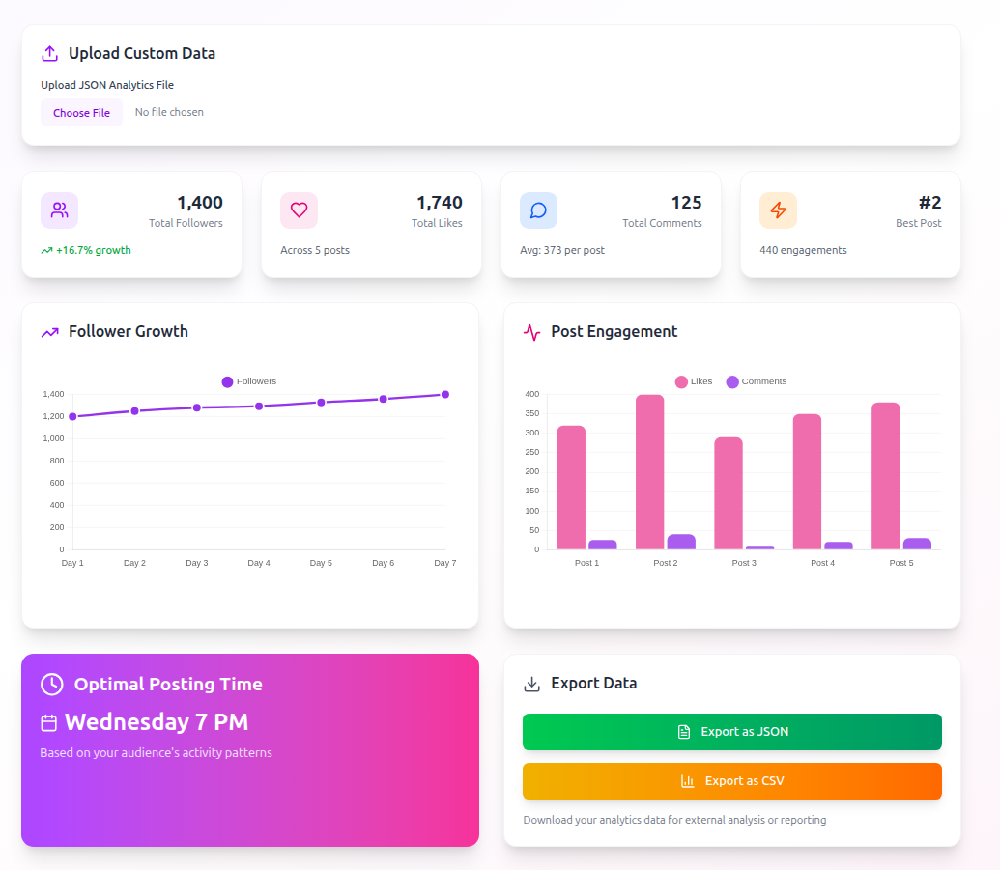

# CreatorIQ 🚀

AI-Powered Instagram Content Generator + Analytics Dashboard built with the **MERN Stack**.
 
📦 **GitHub Repo:** [https://github.com/iamnas/creatoriq](https://github.com/iamnas/creatoriq)

---

## 🧠 Features

### 1. ✨ AI Content Generator
- Enter a topic and select your niche (e.g., fashion, fitness, finance).
- Generates:
  - 🔥 A trending reel idea
  - 📝 A catchy caption
  - #️⃣ Five hashtags
  - 🧲 A hook/first line
- Powered by **OpenAI GPT-4**

### 2. 📊 Instagram Analytics (Simulated)
- Follower growth (7-day line chart)
- Post engagement stats (likes + comments)
- Suggested best time to post
- 📥 Export analytics as `.json`

---

## 🛠 Tech Stack

| Layer     | Tech                        |
|-----------|-----------------------------|
| Frontend  | React + TypeScript + TailwindCSS |
| Backend   | Node.js + Express + Prisma  |
| AI        | OpenAI API (GPT-4)          |
| Database  | MongoDB (Atlas)             |
| Charts    | Chart.js + react-chartjs-2  |
| Auth      | JWT + React Context         |
| Deploy    | Frontend: Vercel<br>Backend: Render |

---

## 📂 Project Structure

```

creatoriq/
├── backend/              # Node.js + Express API
│   ├── src/
│   ├── prisma/
│   └── package.json
│
├── frontend/             # React + Tailwind frontend
│   ├── src/
│   └── public/

````

---

## 🚀 Getting Started Locally

### 1. Clone the repo

```bash
git clone https://github.com/iamnas/creatoriq
cd creatoriq
````

---

### 2. Backend Setup (`/backend`)

```bash
cd backend
pnpm install
pnpm dev
```

Create a `.env` file:

```env
PORT=5000
DATABASE_URL=your_mongodb_uri
JWT_SECRET=your_jwt_secret
OPENAI_API_KEY=your_openai_key
```

---

### 3. Frontend Setup (`/frontend`)

```bash
cd frontend
pnpm install
pnpm dev
```

Make sure the base API URL in `utils/api.ts` points to your local or deployed backend:

```ts
// frontend/src/utils/api.ts
const api = axios.create({
  baseURL: "https://creatoriq.onrender.com/api/v1",
});
```

---

## 🧪 Test Accounts (Optional)

You can register a new account or use:

```txt
email: test@example.com
password: 123456
```

---

## ✅ Deployment

* **Frontend**: [Vercel](https://vercel.com/)
* **Backend**: [Render](https://render.com/)

---

## 💡 Bonus Features

* Token-based auth with JWT
* Saved AI responses to DB
* Upload your own analytics JSON
* Download analytics as `.json` report

---

## 📸 Screenshots




---

## 🤝 License

MIT © [@iamnas](https://github.com/iamnas)

---

